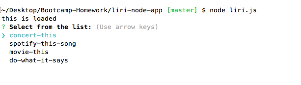
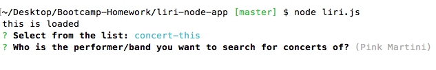
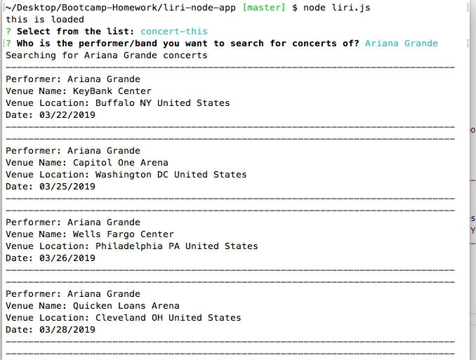
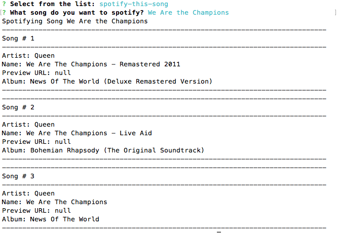
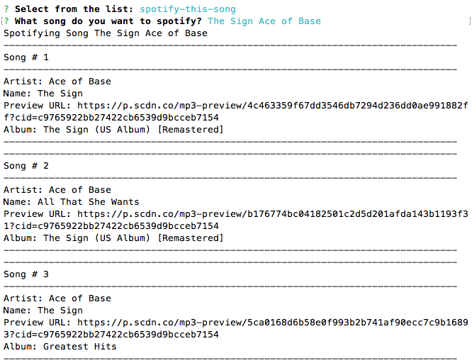
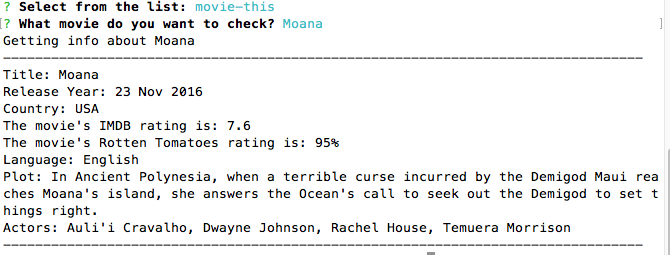
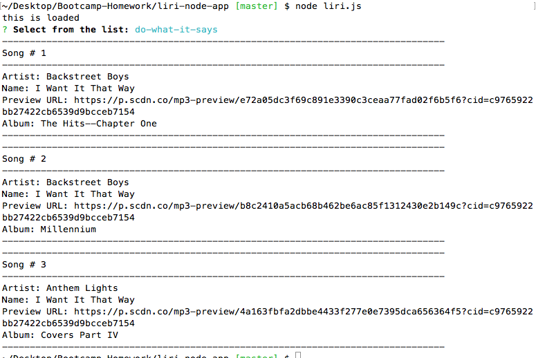

### liri-node-app
### by Halina Z

#### Description

_________________________________________________________________

The CLI program allows user to search Spotify for songs, Bands in Town for concerts, and OMDB for movies. It asks the user using inquirer package to select between search options ("concert-this", "spotify-this-song", "movie-this), or the test option which reads the song's name to search from a text file. 
_________________________________________________________________

The program will ask to choose between the following options:

If a user picks **concert-this** option, the program asks to enter a performer/band name, otherwise using *Pink Martini* as a default band. 

When a user enters a performer's name, the program searches Bands in Town for concerts of the performer, and lists top 10 concerts to the screen:

If the user selects  **spotify-this-song** option, the program will prompt to enter a song's title,and will Spotify API to get the data of the top three tracks with this title: 

If the user enters no title, three top *"The Sign" Ace of Base* tracks will be shown:

If the user picks  **movie-this** option, the program will ask for the movie title to search and will use *"Mr. Nobody"* if the user enetyer nothing:

If the user eneter the movie's name, the program will fetch the information about the movie and print in to console:

If the user picks the last option <do-what-it-says>, the program will read the song's name from "random.txt" file, and use spotify to search the song's data and display the top 3 records:  

_________________________________________________________________

Technologies used:
  * node.js
  * APIs: 
    * Node-Spotify-API
    * OMDB API
    * Bands In Town API
  * Packages: 
    * Axios
    * Moment
    * DotEnv

_________________________________________________________________